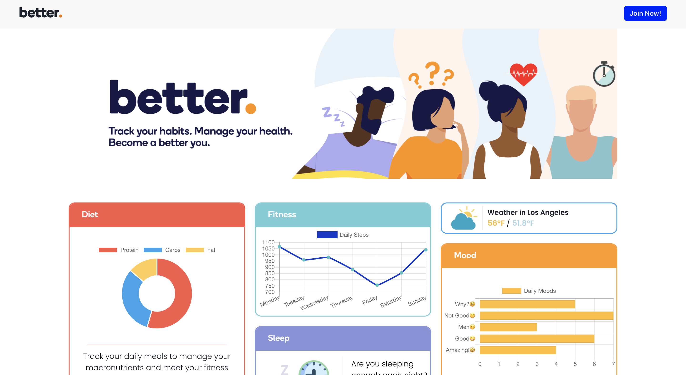
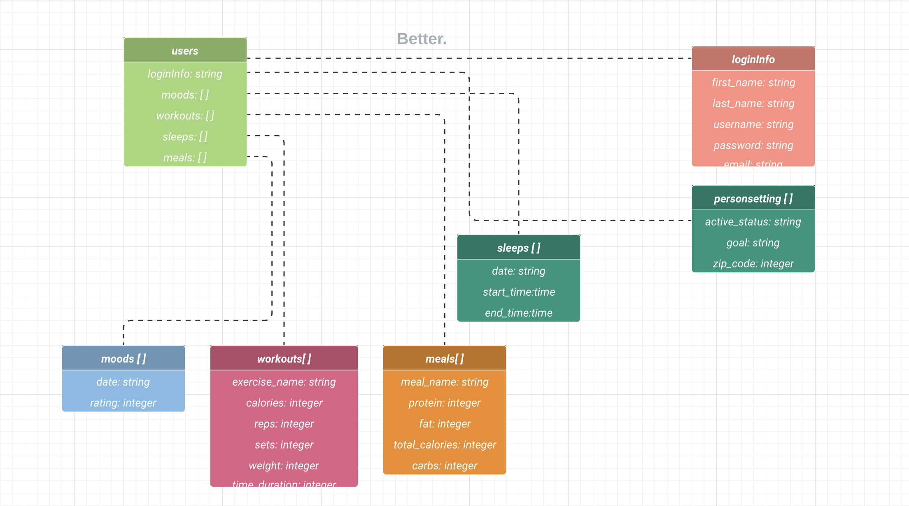
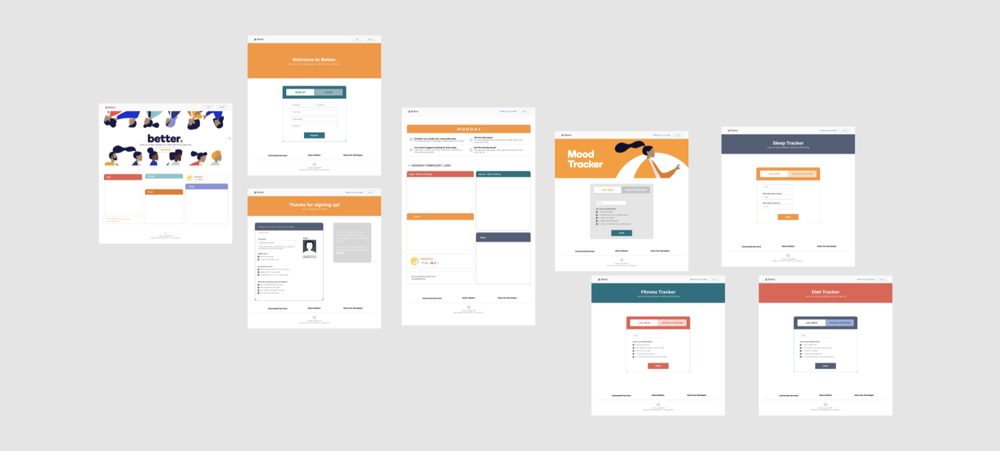
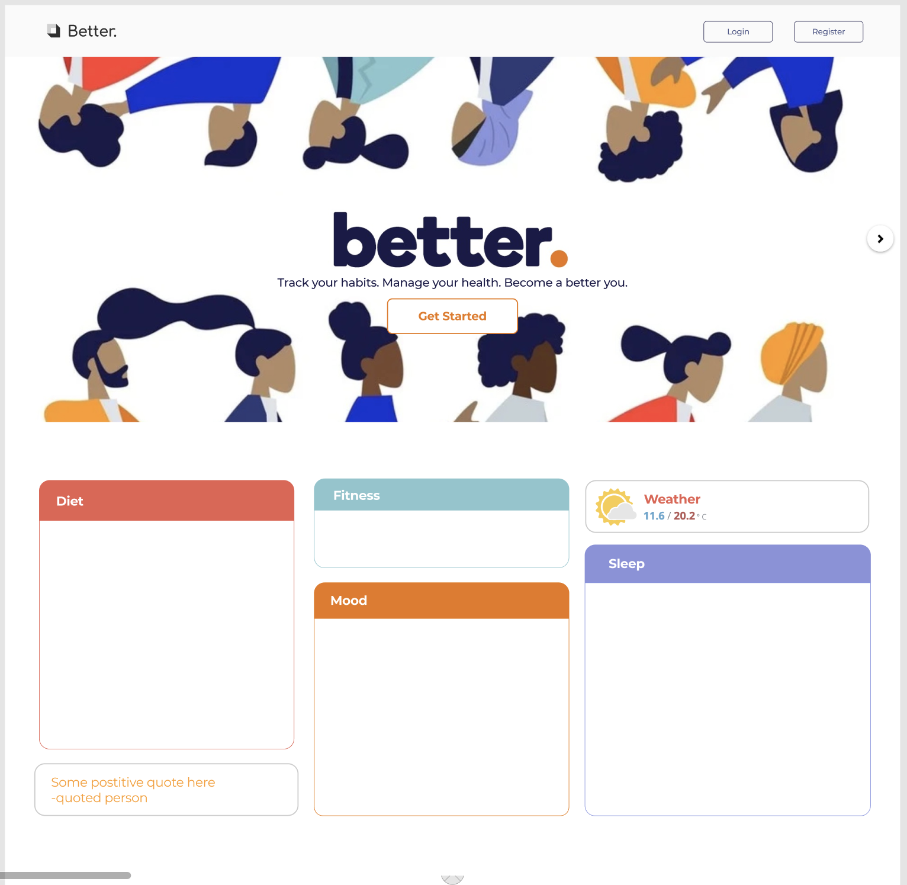
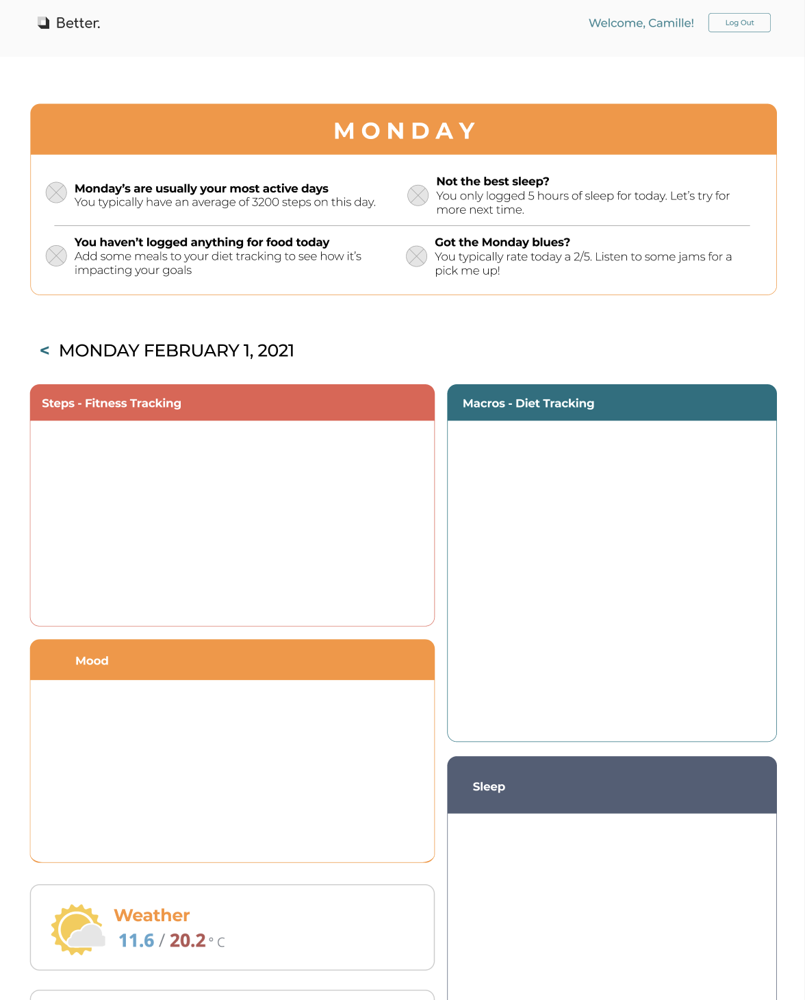
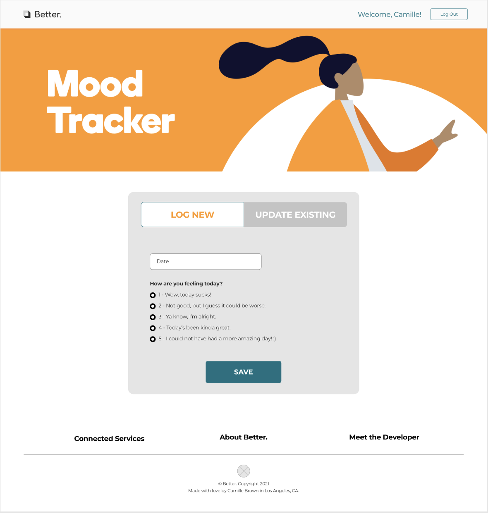
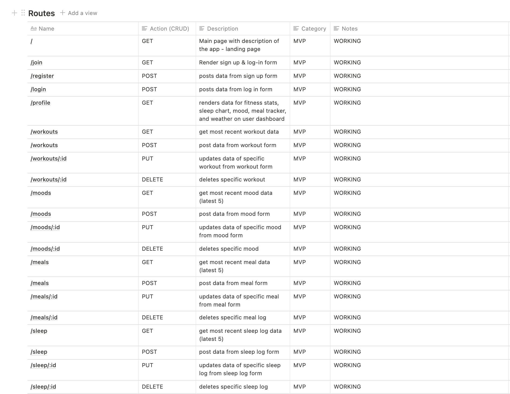

 # better. 

 ---

## How to Set Up:
1. Fork & Clone
2. Install dependencies
```
npm i
```

---

## Concept:

Better. App allows user to track their daily fitness activity, moods, sleep patterns, and meals over time. Using charts and graphs that make it easy to understand, the user can get insights into how each goal gets 'better'.

## Technologies Used:

* Python 3
* Flask / Peewee
* Next.js
* React

## Resources Used:
* Chakra UI
* FontAwesome
* Axios
* Day.js
* Chart.js
* [FreePik Icons](https://www.freepik.com/)
* [Open Weather API](https://openweathermap.org/api)
* [Zen Quotes API](https://zenquotes.io/#docs)

## Approach:

### App Components

* Home Page
* User Auth Pages (Login/Sign Up)
* User Setting Form Page
* User Dashboard
* Moods Dashboard
* Workouts Dashboard
* Meals Dashboard
* Sleep Dashboard
* Mood Form Page (Add/Update)
* Workout Form Page (Add/Update)
* Meal Form Page (Add/Update)
* Sleep Form Page (Add/Update)

### ERD:


### Original Wireframes:




[Remaining Figma Wireframes](https://www.figma.com/file/NYaHn4GiOgXZud07yDWa39/Better.-App?node-id=5%3A342 "@embed")

### Color Pallete:

-  `#f85c4a`
-  `#FF9B20`
-  `#76cdd8`
-  `#8A90DB`
-  `#d8d8d8`
-  `#1d0038`
-  `#EA7613`


### User Stories:

**MVP**

1. As a user, I want to be able to see a landing page before I log in/sign up so I can know more about the app.
2. As a user, I want to be able to sign up, log in, and log out of the app.
3. As a user, I want to be able to access a dashboard to see the current weather in my area, my sleep logs, my fitness logs, my diet logs and my mood logs
4. As a user, I want to be able to create, read, update, and delete any log on my dashboard
5. As a user, I want to be able to create, read, update, and delete any log on the specific component page.

**Stretch**

1. As a user, I want to be able to pull in data from any of my connected apps onto my dashboard
2. As a user, I want to be able to get insights into how my activities are trending over time
3. As a user, I want to be able to update my location or profile settings to see data relative to the updated information.
4. As a user, I want to be able to toggle between daily, weekly or monthly view of my dashboard stats.
5. As a user, I want to be able to see weather data for my area


### Routes:

| Route | HTTP Verb | CRUD | Model | Explanation			
| ------------- | ------------- | ------------- | ------------- | ------------- |			
| `"/"` ✅| N/A | N/A | N/A | Renders home page with dummy data			
|`"/register"`✅ | POST | CREATE | `user` | Renders form for new user to sign up			
|`"/login"` ✅| POST | CREATE | `user` | Renders form for user to login			
|`"/profile"` ✅| GET | READ | `user` & `personsetting` & `sleep` & `mood` & `meal` & `fitness`| Displays user's moods, sleep logs, meals and fitness activity in a dashboard
|`"/workouts"` ✅| GET | READ | `user` & `fitness` | Displays all user's logged workouts			
|`"/workouts"` ✅| POST | CREATE | `user` & `fitness` | Creates a new workout in the user's database		
|`"/workouts/:id"` ✅| PUT | UPDATE | `user` & `fitness` | Updates workout in the user's database
|`"/workouts/:id"` ✅| DELETE | DELETE | `user` & `fitness` | Deletes workout from user's database
|`"/sleep"` ✅| GET | READ | `user` & `sleep` | Displays all user's logged sleep logs			
|`"/sleep"` ✅| POST | CREATE | `user` & `sleep` | Creates a new sleep log in the user's database	
|`"/sleep/:id"` ✅| PUT | UPDATE | `user` & `sleep` | Updates sleep log in the user's database
|`"/sleep/:id"` ✅| DELETE | DELETE | `user` & `sleep` | Deletes sleep log from user's database
|`"/meals"` ✅| GET | READ | `user` & `meal` | Displays all user's logged meals			
|`"/meals"` ✅| POST | CREATE | `user` & `meal` | Creates a new meal in the user's database		
|`"/meals/:id"` ✅| PUT | UPDATE | `user` & `meal` | Updates meal in the user's database
|`"/meals/:id"` ✅| DELETE | DELETE | `user` & `meal` | Deletes meal from user's database
|`"/moods"` ✅| GET | READ | `user` & `mood` | Displays all user's logged moods			
|`"/moods"` ✅| POST | CREATE | `user` & `mood` | Creates a new mood log in the user's database		
|`"/moods/:id"` ✅| PUT | UPDATE | `user` & `mood` | Updates mood log in the user's database
|`"/moods/:id"` ✅| DELETE | DELETE | `user` & `mood` | Deletes mood log from user's database
		
<br/>
<br/>

---

---

<br/>
<br/>

		
### MVP:
- Signup, login & logout  ✅
- Render home/about page  ✅
- Render user dashboard (mood, workout, sleep, and meal data)  ✅
- Full CRUD for Moods  ✅
- Full CRUD for Sleep Logs  ✅
- Full CRUD for Meals  ✅
- Full CRUD for Workouts  ✅


### Stretch Goals:
- User can see weather data for their area
- User can pull in data from any connected apps onto their dashboard 
- User can see insights into how activity trends over time
- User can update my location or profile settings
- User can toggle between daily, weekly or monthly view dashboard

## Challenges:
- Pulling data into daily insights
- Saving form data based on dropdown selection to database
- Loading all data for the dashboard using setTimeout